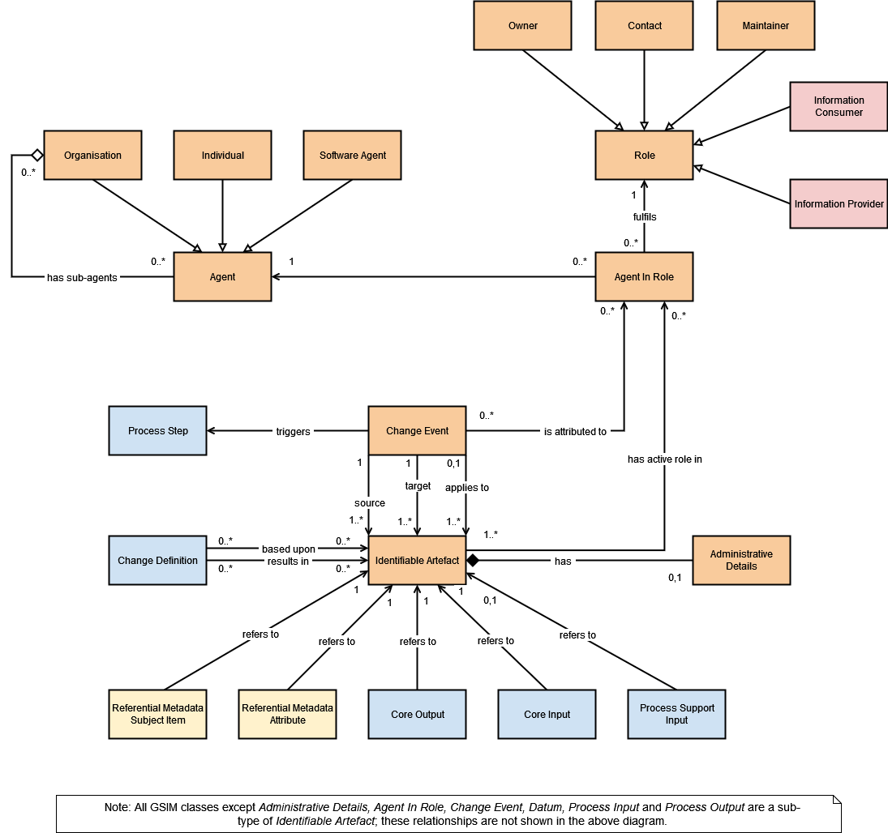

# Generic Statistical Information Model (version 2.0)

This is the GitHub repository for version 2.0 of the Generic Statistical Information Model (GSIM). 

**Please [visit this page to see the model](https://unece.github.io/GSIM-2.0/GSIMv2.html)**

The revision for GSIM 2.0 was possible thanks for the contributions of many colleagues in national and international statistics organiation ( https://unece.github.io/GSIM-2.0/GSIMv2.html#acknowledgements).

For a summary of changes to GSIM since version 1.2, please refer to this page [refer to this page](https://github.com/UNECE/GSIM-2.0/blob/42b3f8ea173fd31a451e25b110ba7979a6064e40/Changes%20since%20GSIM%20v1.2/Introduction.md)

For information about _previous versions_ of GSIM, you may consult the [UNECE Statistics Wiki site](https://statswiki.unece.org/display/gsim/Old+versions+of+GSIM)

**Help us to make learning GSIM 2.0 a more immersive experience!**

While we have already made available some interactive UML diagrams to allow users to navigate across the relationships between information classes, we would like to augment this with extra information on class definitions built into the diagrams. - Please help us to achieve this by upvoting this feature request on our UML diagram plugin: [Feature request](https://github.com/jgraph/drawio/discussions/4094)

**Test**
[//]: #  
[//]: #  

,

